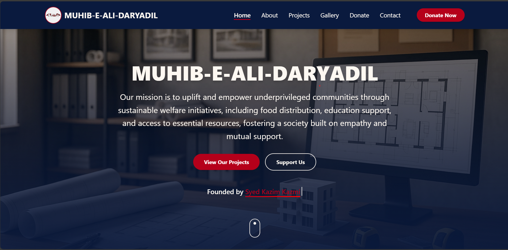

# 🌍 MUHIB-E-ALI-DARYADIL — Humanitarian Welfare Organization

A responsive and modern **Next.js** website for the MUHIB-E-ALI-DARYADIL welfare organization.  
Showcasing the mission, projects, gallery, and ways for supporters to contribute to humanitarian causes.

---

## 🌟 Features

- 🔹 **Responsive Design** – Works seamlessly on all devices.
- 🔹 **Projects Section** – Highlights various welfare initiatives.
- 🔹 **Gallery Page** – Displays images of activities and events.
- 🔹 **Donation Page** – Front-end ready for payment integration.
- 🔹 **Contact Page** – Easy communication with the organization.
- 🔹 **Static Data Driven** – Content managed from local data files.
- 🔹 **Fast & Optimized** – Built with Next.js for speed and performance.

---

## 📸 Preview



---

## 🛠️ Tech Stack

- **Next.js** – React framework for SSR & SSG
- **TypeScript** – Strongly typed JavaScript
- **CSS** – Styling and layout
- **Vercel** – Deployment platform

---

## 🚀 Getting Started

1. **Clone the repository**
   ```sh
   git clone https://github.com/Shafiullah717/muhib-e-ali-daryadil.git
   ```
2. **Navigate to the project folder**
   ```sh
   cd muhib-e-ali-daryadil
   ```
3. **Install dependencies**
   ```sh
   npm install
   ```
4. **Run the development server**
   ```sh
   npm run dev
   ```
5. **Open in browser**  
   Go to 👉 `http://localhost:3000`

---

## 🌎 Live Demo

🔗 [View Live Website](https://muhib-e-ali-daryadil.vercel.app/)

---

## 🎯 Contributing

Contributions are welcome! 🎉  
- Fork the repository  
- Create a new branch for your feature/fix  
- Submit a Pull Request 🚀

---

## 📬 Contact

📧 Email: shafiullahcheema@gmail.com  
🐦 GitHub: [Shafiullah717](https://github.com/Shafiullah717)  
💼 LinkedIn: [Shafi Ullah](https://www.linkedin.com/in/shafi-ullah-086b83284/)  

---

💙 If you like this project, don’t forget to **star** it on GitHub! ⭐
